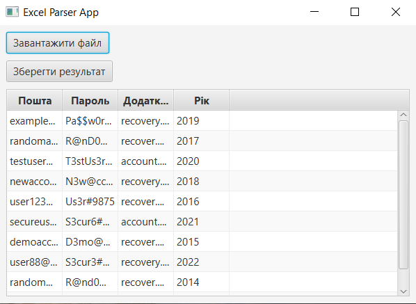

# txt2xlsx

txt2xlsx is a simple tool that converts text files to Excel (xlsx) format.

Firstly, you need a file with .txt and format [email] [password] [recovery email] [year]


Then, you can choose your file and it will be displayed in table



## Installation

Clone the repository to your local machine:

```bash
git clone https://github.com/Jurdio/txt2xlsx.git
